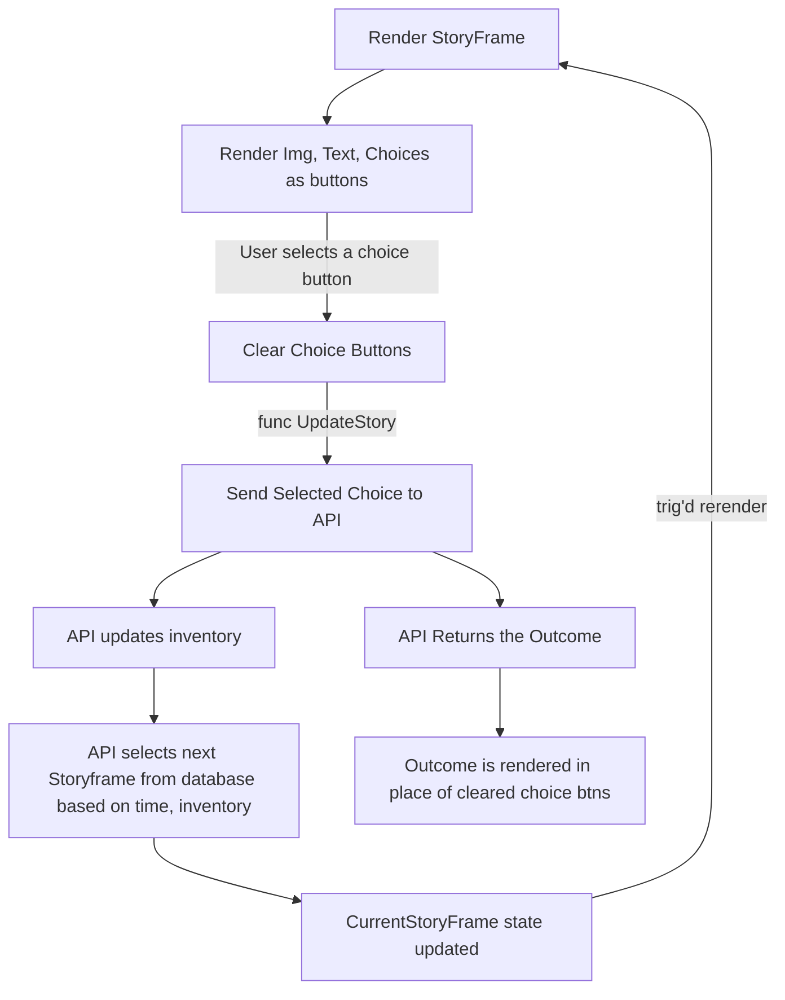

# (insert cool game name here)

# How to run locally on your computer
1. `cd` into the directory where you want this repo
2. Clone the repo: `git clone https://github.com/wintrmut3/spark-frosh-game.git`
3. Go into the repo directory: `cd spark-frosh-game`
4. Install dependencies (takes a few mins): `npm install`
5. Start the app on localhost:3000 (aka your computer, port 3000): `npm start`
6. A new tab should open on your browser with the app
7. Whenever you make changes to the code, all you have to do is save. The new changes will appear on that tab.
8. If your code is broken, your browser tab will display the error instead of the app.
9. Enjoy
    
# Story Frame Data Structure -- A list of these is stored as the 'database'

```js
// Definition of StoryFrames
class StoryFrame {
    constructor(storyText:string, storyChoices, storyOutcomes, selectionFilters, pictureLink, stateMutators, eventID, timeBucket) {
        this.storyText = storyText              // A string representing the main story text
        this.storyChoices = storyChoices        // A string array of size N representing choices
        this.storyOutcomes = storyOutcomes      // A string array of size N representing corresponding outcomes
        this.selectionFilters = selectionFilters// don't worry about this one, it will be manual
        this.pictureLink = pictureLink          // A string linking to an image
        this.stateMutators = stateMutators      // dont worry about this one, it will be manual
        this.timeBucket = timeBucket            // An enum (dropdown choice) representing which time bucket it falls under
    }
}
```

# Program Loop


